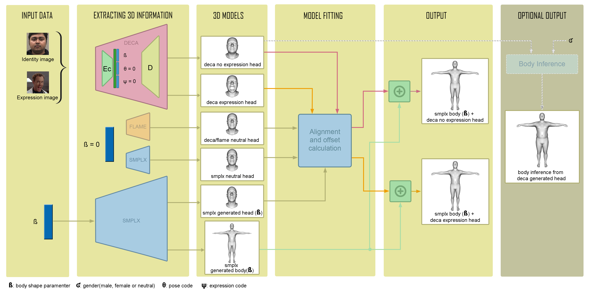
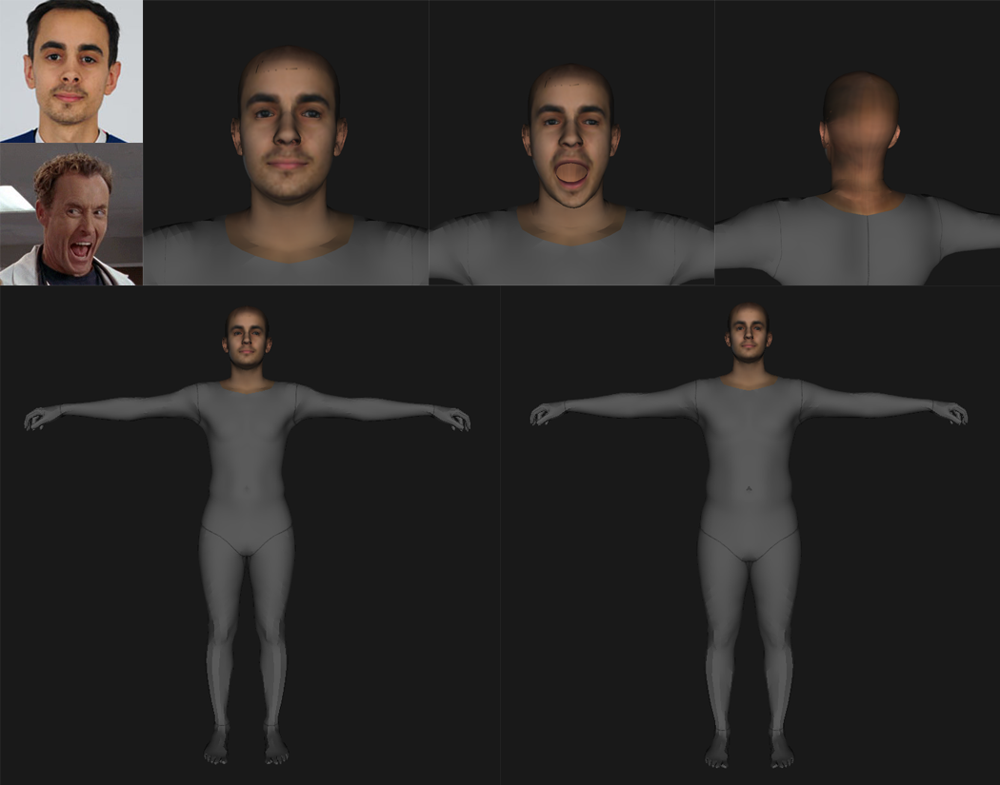
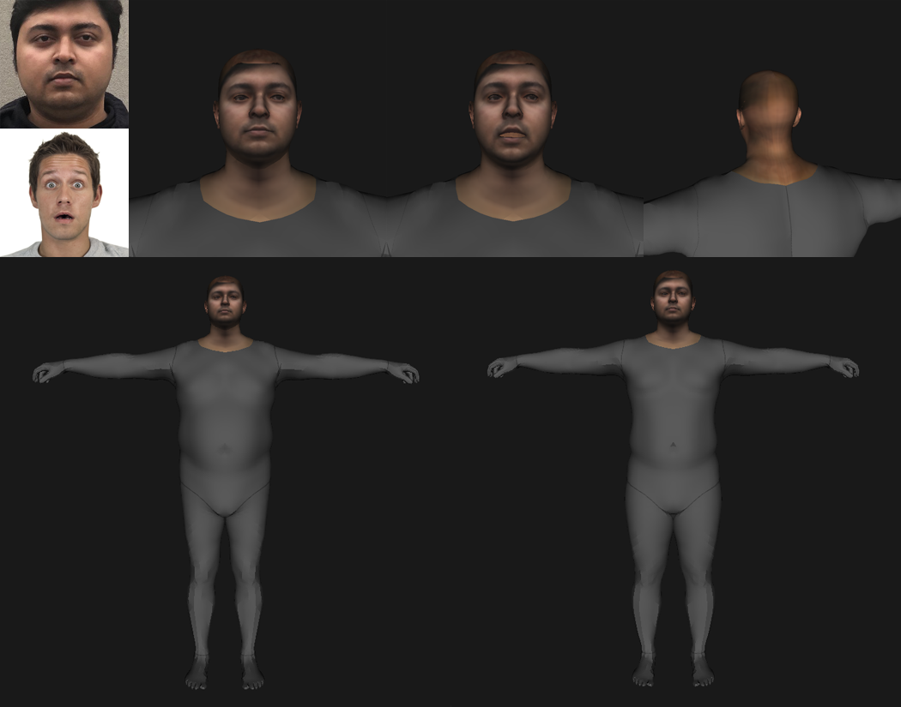
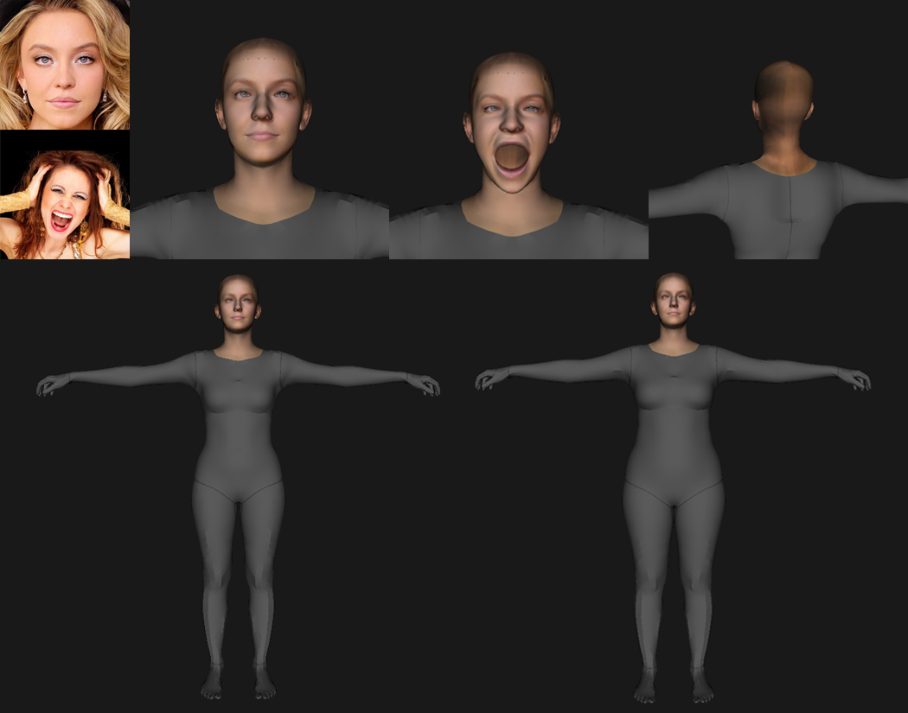
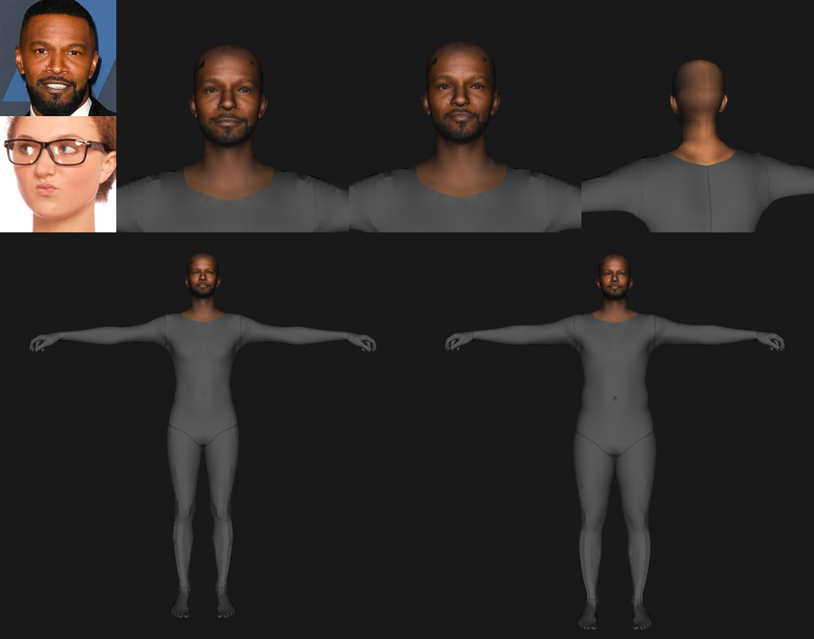

<h2 align="center">HUMAN AVATAR CREATION THROUGH DEEP LEARNING MODELS (SMPLX-DECA)</h2>

<h2>What is this work about?</h2>

The present work is the thesis of my undergraduate studies, which focuses on the creation of 3D human avatars using deep learning parametric models based on real human data (SMPL-X and DECA), with the aim of achieving realistic avatars from easily accessible input data such as images taken with a cell phone. For this purpose, the two models are merged and their functionalities are extended. In addition, special emphasis is placed on the texturing process of the head, even correcting the possible inaccuracies of alignment in the textures present in some avatars due to the low resolution of the input images. As a result, through several images (depending on the mode) and customization of the body in the friendly UI integrated, the user is able to generate multiple human avatars ready to be integrated into a video game engine.

<h2>What aspects are the most remarkable of the implementation?</h2>
<ul>
  <li>Fusion of both pipelines into one.</li>
  <li>UI for body shape and face expression creation.</li>
  <li>Automatic body creation based on face input shape through optimization techniques.</li>
  <li>Automatic face texturizer and inpainter.</li>
  <li>Eye alignment through optimization techniques for texturing phase.</li>
  <li>Total abstraction for the user.</li>
  <li>Runtime optimization. Average body creation time in author's computer is 1 minute and 30 seconds.</li>
</ul>

<h2>Pipeline</h2>

  

<h2>Results</h2>

Beforehand, the results need to be clarified. From upper-left to bottom-right: 

<ul>
  <li>[1] Identity input image.</li>
  <li>[2] Expression input image.</li>
  <li>[3] Close-up of inexpressive face final result.</li>
  <li>[4] Close-up of expressive face final result.</li>
  <li>[5] Close-up of the back of the head final result.</li>
  <li>[6] Body generated with user-defined parameters, using the UI.</li>
  <li>[7] Body generated with automatic body generation based on head shape.</li>
</ul>

 

  
  
  
  

